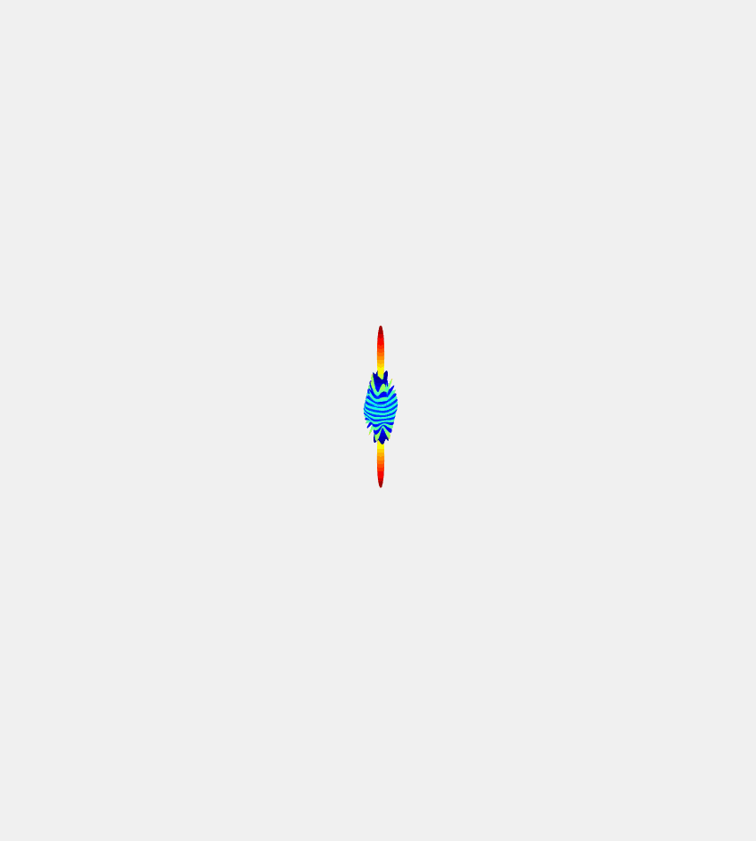

# SAF PACKAGE

The +saf package includes functions that are used to build the Symmetry Adapted Functions (SAFs), which are icosahedrally symmetric linear combinations of Laplacian spherical harmonics. The exact combination of spherical harmonics to yield icosahedral SAFs is outlined in the paper: [A Recursive Algorithm for the Generation of Symmetry-Adapted Functions: Principles and Applications to the Icosahedral Group](http://scripts.iucr.org/cgi-bin/paper?S0108767395012578)

Let's explore this package by checking out SAF6. According to the algorithm outlined in the above paper, SAF6 con be constructed by the following linear combination:


Where Y is the Laplacian spherical harmonic, the subscript is the degree, and the exponent is the order. This will be encoded as Y(l, m) in the following table, where l = degree and m = order.

| Linear Combination |  SAF6 |
| --- | --- |
|  |  |

We can make these plots using the functions contained in the SAF package.

```MATLAB
l = 1; % Degree
m = 0; % Order

ejovo.saf.plotRealHarmonic(l, m); % Plot real spherical harmonic with degree = 1 and order = 0
ejovo.saf.plotHarmonic(l, m); % Plot the real and imaginary values of spherical harmonic with degree = 1 and order = 0

ejovo.saf.plotSAF(6); % Plot SAF made from linear combination of spherical harmonics of degree 6
ejovo.saf.animateSAF(6); % Animate the linear combination for SAF6

```

Here is a table that contains all the SAFs included in this package. Icosahedral symmetry demands the presence of a symmetry axes of degree 5, 3, and 2.

| Degree | 5-fold | 3-fold | 2-fold | SAF |
| --- | --- | --- | --- | --- |
| 6 |  |  |  |  |
| 10 |  |  |  |  |
| 12 |  |  |  |  |
| 16 |  |  |  |  |
| 18 |  |  |  |  |
| 20 |  |  |  |  |
| 22 |  |  |  |  |
| 24 |  |  |  |  |
| 26 |  |  |  |  |
| 28 |  |  |  |  |
| 30 |  |  |  |  |
