# SAF PACKAGE

The +saf package includes functions that are used to build the Symmetry Adapted Functions (SAFs), which are icosahedrally symmetric linear combinations of Laplacian spherical harmonics. The exact combination of spherical harmonics to yield icosahedral SAFs is outlined in the paper: [A Recursive Algorithm for the Generation of Symmetry-Adapted Functions: Principles and Applications to the Icosahedral Group](http://scripts.iucr.org/cgi-bin/paper?S0108767395012578)

Let's explore this package by checking out SAF6. According to the algorithm outlined in the above paper, SAF6 con be constructed by the following linear combination:


Where Y is the Laplacian spherical harmonic, the subscript is the degree, and the exponent is the order. 

| Linear Combination |  SAF6 |
| --- | --- |
|  |  |

We can make these plots using the functions contained in the SAF package.

```MATLAB
l = 1; % Degree
m = 0; % Order

ejovo.saf.plotRealHarmonic(l, m); % Plot real spherical harmonic with degree = 1 and order = 0
ejovo.saf.plotHarmonic(l, m); % Plot the real and imaginary values of spherical harmonic with degree = 1 and order = 0

ejovo.saf.plotSAF(6); % Plot SAF made from linear combination of spherical harmonics of degree 6
ejovo.saf.animateSAF(6); % Animate the linear combination for SAF6

```

Here is a table that contains all the SAFs included in this package. Icosahedral symmetry demands the presence of symmetry axes of degree 5, 3, and 2.

| Degree | 5-fold | 3-fold | 2-fold | SAF |
| :---: | --- | --- | --- | --- |
| 6 |  |  |  |  |
| 10 |  |  |  |  |
| 12 |  |  |  |  |
| 16 |  |  |  |  |
| 18 |  |  |  |  |
| 20 |  |  |  |  |
| 22 |  |  |  |  |
| 24 |  |  |  |  |
| 26 |  |  |  |  |
| 28 |  |  |  |  |
| 30 |  |  |  |  |

plots were made using the "jet" colormap, such that high positive values correspond to red and the most negative values are represented by dark blue.

### Alternative Representation.

We can further elucidate the symmetry of these structures by coloring the radial output of each SAF on the surface of a sphere.

I've introduced a new saf class which allows me to better manipulate the addition of SAFs.
To instantiate an SAF object, simply pass the degree that you would like for the argument:

```MATLAB
s6 = ejovo.v.saf(6); % Create new SAF with degree 6.
s10 = ejovo.v.saf(10);
s12 = ejovo.v.saf(12);
s26 = ejovo.v.saf(26);
```

We can plot these SAFs calling the plot member function. What's more interesting, however, is creating new SAF objects by simple combination:

```MATLAB
s_new = s6 + s12;
s_new.plot();
```


```MATLAB
s_new = s10 + s26;
s_new.plot();
```


I've also introduced a new way of visualizing the SAFs by coloring the radial component onto a surface of a sphere. To do so, we can simply call the **surf** function:

```MATLAB
surf(s10 + s26);
```


```MATLAB
surf(s6 + s12);
```


To visualize all of the SAFs on the surface, we can simply call the static function **surfALL**:

```MATLAB
ejovo.v.saf.surfAll();
```


# Just for fun

Now that we have an saf class in place, an addition operator overload, and a mechanism to visualize them, we can start to have some nonsensical fun. I played around with MATLAB's gui editor to come up with the following simple (and ugly, I'm not a graphic artist lol) gui:

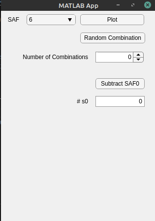

The idea is that we can start with a base SAF and add a random combination of the other SAFs to generate some funky visuals.

Let's set the number of combinations to 5 and play around with the resulting combinations by clicking the **Random Combination** button:

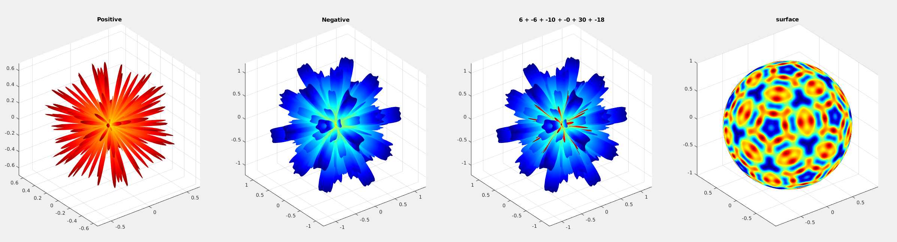
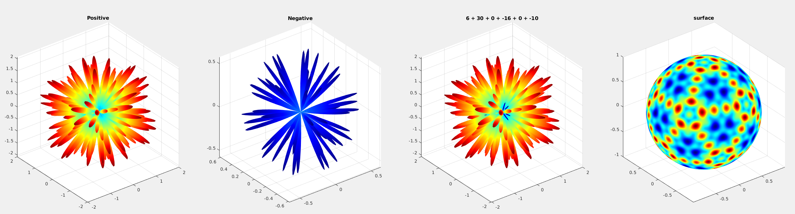
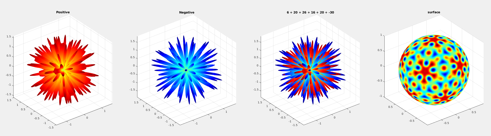
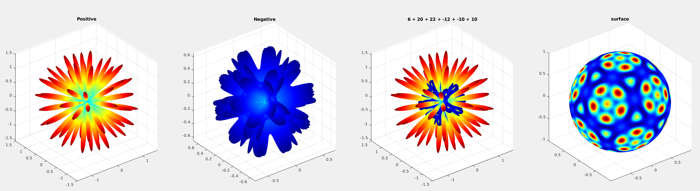
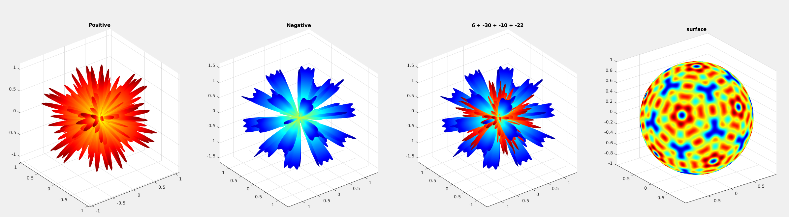
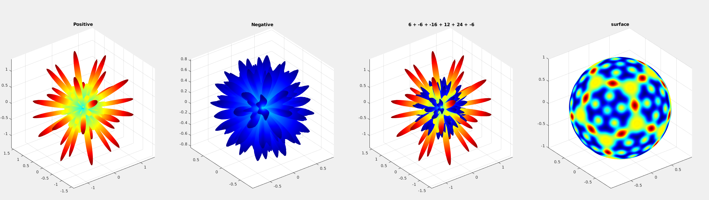

We can do something really fun and subtract SAF0 (Just a sphere) from each base SAF to see how "aspherical" the SAF really is. These visualizations are by far my favorite.

Setting the value of of the **#s0** field to 10, here are the resulting visualizations, starting from SAF6 - 10 * SAF0 to SAF30 - 10 * SAF0.

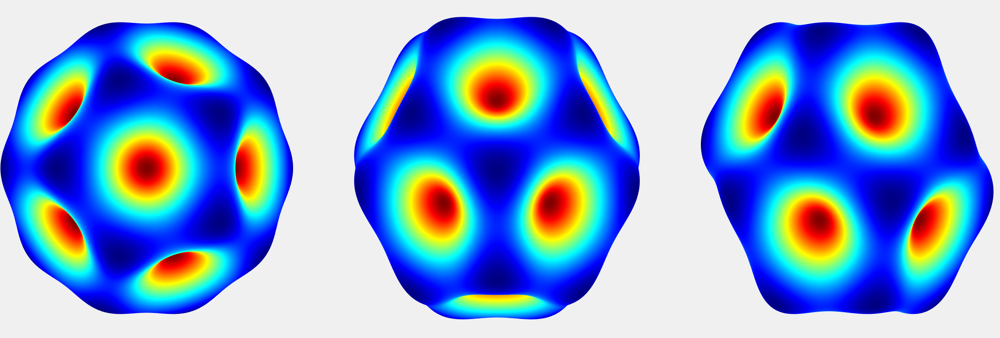
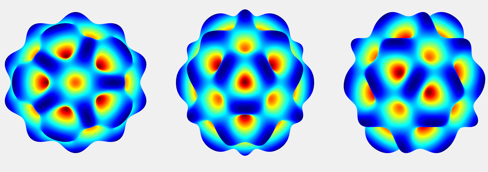
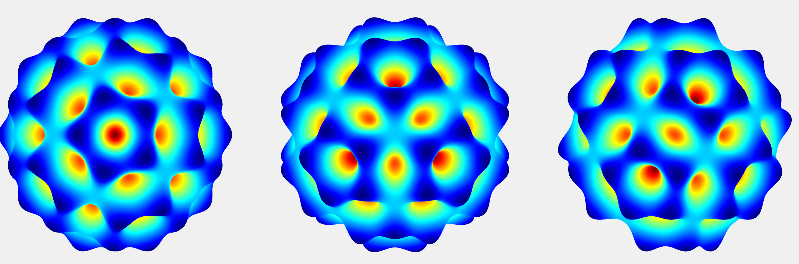


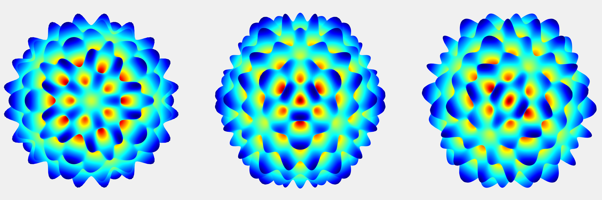
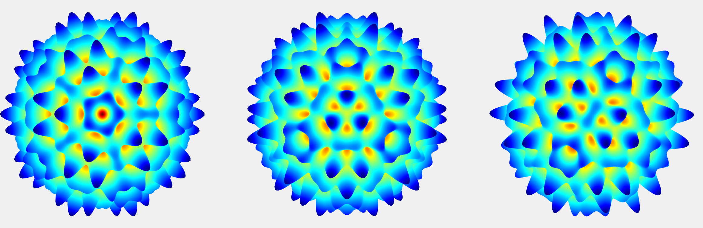
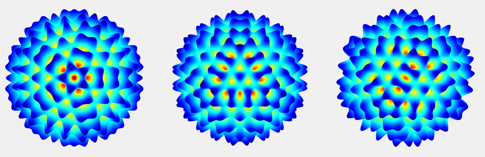
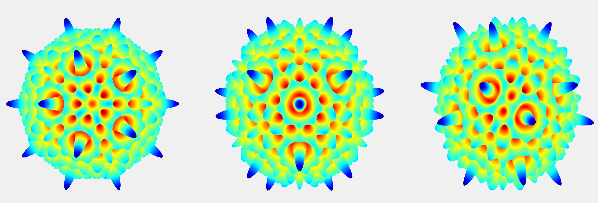
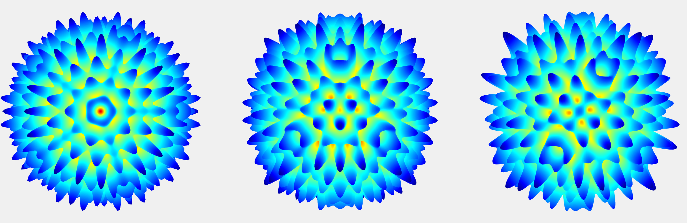


