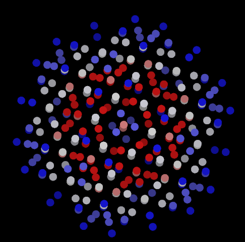
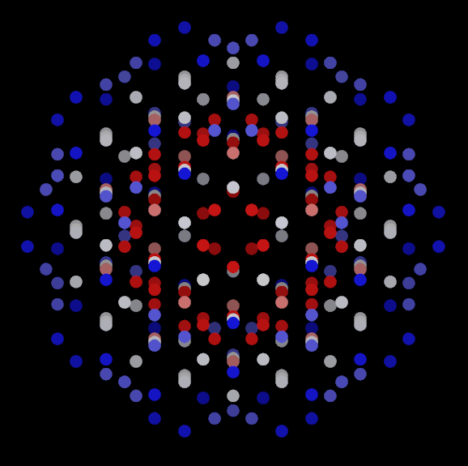
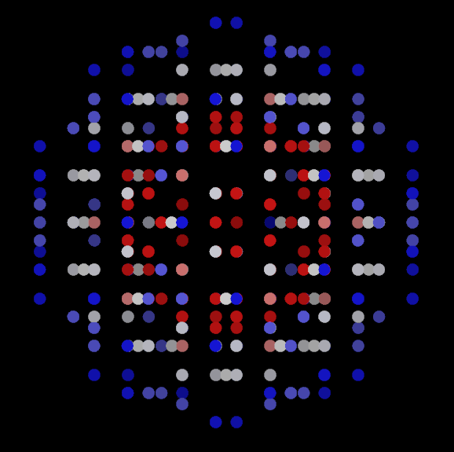
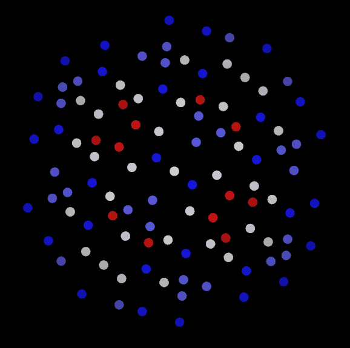
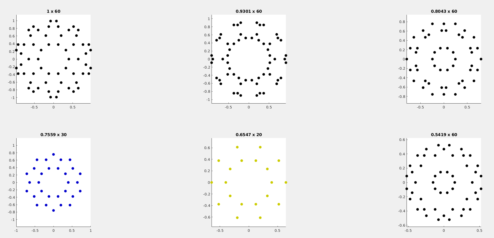
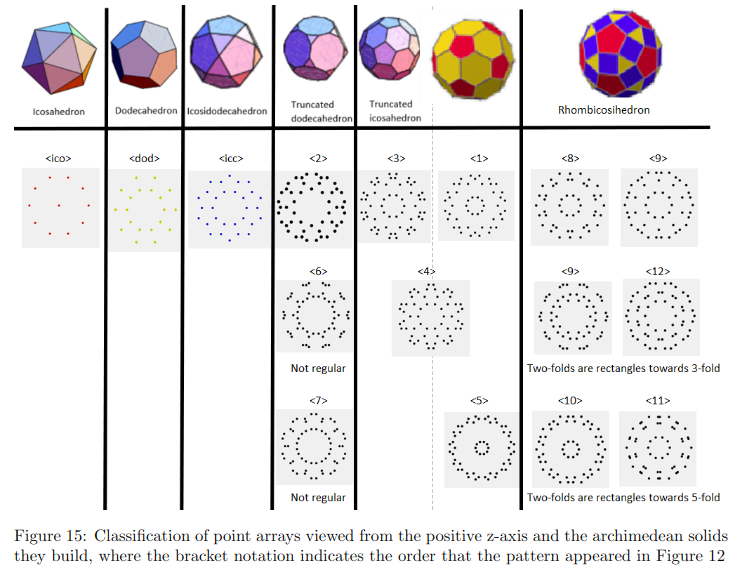

# Point Arrays

Point Arrays are icosahedral structures that extend symmetry along the radial level. This class is based on the point arrays that Dr. Dave Wilson at Kalamazoo College uses in his analysis of virus stability. For more information, check out his publication: [Unveiling the Hidden Rules of Spherical Viruses Using Point Arrays](https://www.mdpi.com/1999-4915/12/4/467)

| Icosadocdecahedron base translated along 3-fold symmetry axis | Icosadodecahedron base translated along 5-fold symmetry axis  | Dodecahedron base translated along 5-fold symmetry axis|
| --- | --- | --- |
|  |  |  |

## @pointArray

The point array class is a MATLAB implementation to model these structures. We can classify each array, combine arrays, and decompose them by their radii to examine radial symmetry. Take for example the 2phi IDD5 point array (middle column in the above table) that was built in MATLAB, and then exported to vmd for viewing:
| 3-d view | rotated about X-axis | rotated about y-axis | rotated about z-axis |
| --- | --- | --- | --- |
|  |  |  |  |

We can decompose this point array to view the symmetry of it's distinct radial levels using the *plotRadialLevels* class method:
```MATLAB
p1 = Mvpa(1); % Array of 569 pointArray objects created by affine extensions
p1.plotRadialLevels;
```


This function call breaks down the point array into its radial levels. We are viewing the radial levels of these 3d point arrays from the xy-plane. The title of each subfigure indicates the relative scale of the radius and the number of points found in that radial level. The color of the points indicates the shape of the radial level. Red = icosahedron. Blue = dodecahedron. Yellow = Icosidodecahedron. Black points mean that the shape at the radial level is not one of the base icosahedrons, and instead is one of the other icosahedral Archimedean solids.


For more information about the geometries of point arrays, check out this paper: [An Exploration of Point Array Geometries](../media/MC2_PointArrayAnalysis_EvanVoyles.pdf)