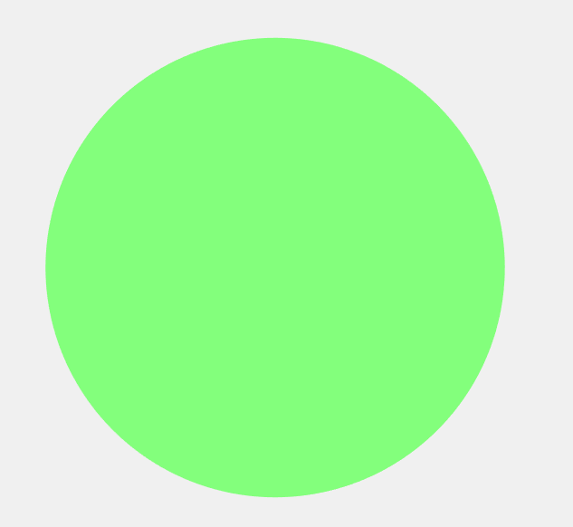
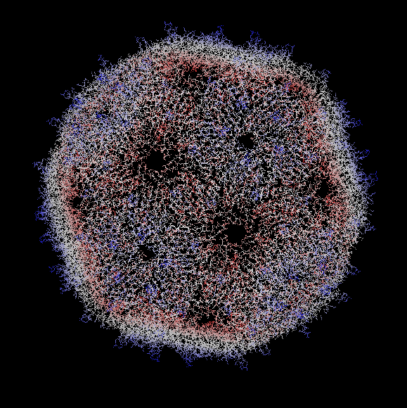
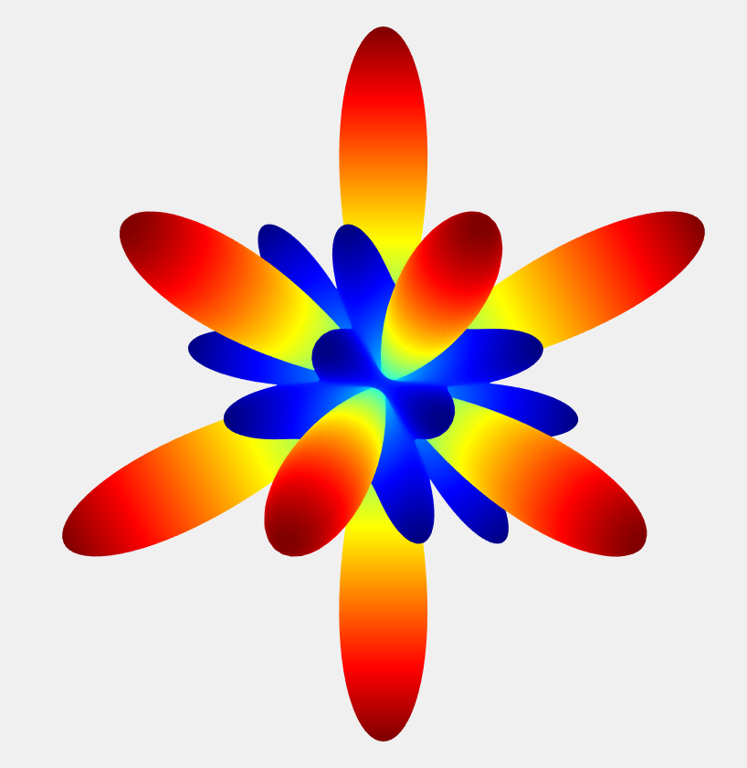
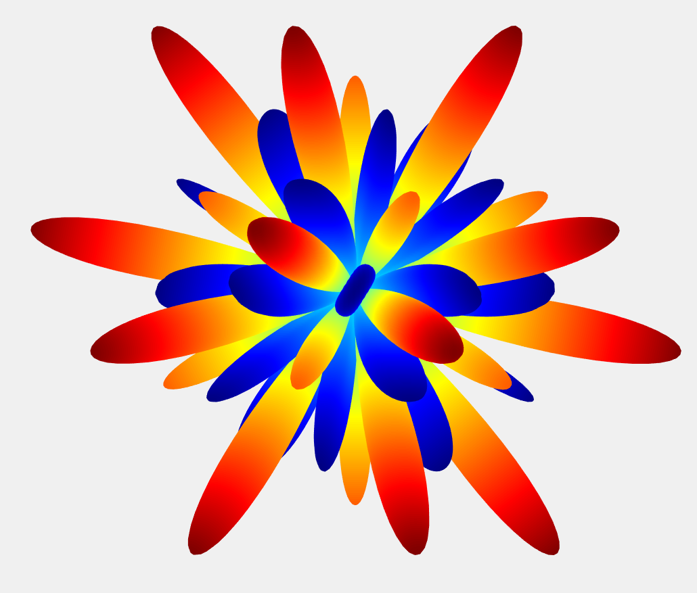

# Decomposition of Virus Normal Modes

Virus normal modes computed with the [NMFF software suite](https://mmtsb.org/software/nmff.html) can be used to build viral maturation pathways. 
These oscillations are difficult to classify and compare, as they are stored on disk as matrices with millions of entries (num_atoms x num_atoms).
Using special linear combinations of spherical harmonics we can generate icosahedrally symmetric spherical functions, or [Symmetry Adapted Functions (SAFs)](https://github.com/ejovo13/viruses/tree/master/%2Bsaf).
We can decompose the computed normal modes using these SAFs to create a useful tool that classifies and compares these complicated oscillations.

The following table shows modes computed with NMFF for Bacteriophage MS2 and the SAF that had the most overlap after mode decomposition. The right column shows an "artificial" mode generated using the +ejovo package in MATLAB. Modes were visualized in VMD.

| Computed Mode | SAF with highest overlap | SAF generated mode |
| ---- | --- | ---- |
|  |  |  | 
|  |  |  |
|  |  |  |

It's pretty easy to tell that for the first two normal modes, the actual computed oscillations line up **incredibly** well with the radial displacements predicted by each SAF. The first mode has uniform contraction and expansion, which we refer to as the *breathing* mode. For the second normal mode, we see the largest radial displacement ocurring along the 5-fold symmetry axes, which lines up with the SAF predicted mode.

The generation and manipulation of SAFs is at the **heart** of this project and my research, so I highly encourage you to check out the +saf package located in the +ejovo directory. If you are interested in the details and numerical analysis of virus normal mode decomposition, check out my senior thesis: [Decomposition of Virus Normal Modes into Spherical Harmonics](+ejovo/media/SIP.pdf)