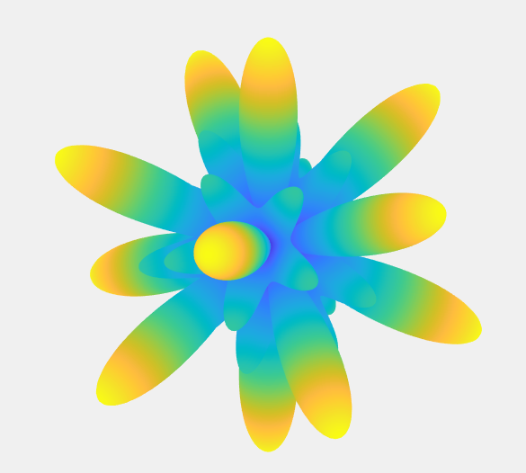
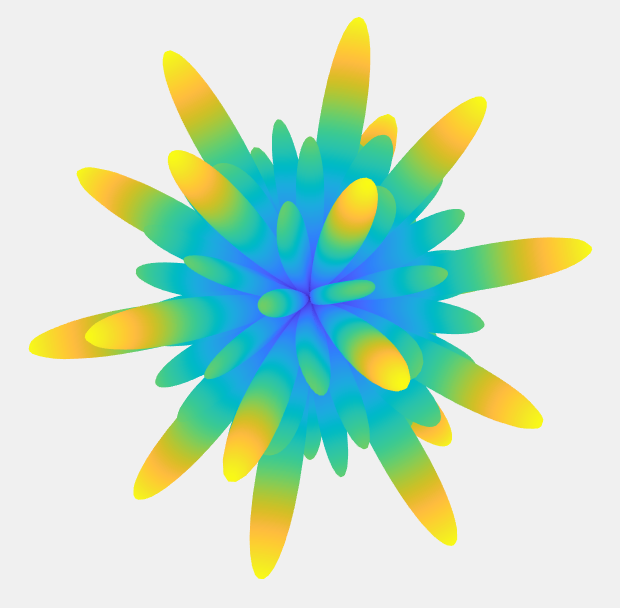

# Decomposition of Virus Normal Modes

Virus normal modes computed with the [NMFF software suite](https://mmtsb.org/software/nmff.html) can be used to build viral maturation pathways. 
These oscillations are difficult to classify and compare, as they are stored on disk as matrices with millions of entries (num_atoms x num_atoms).
Using special linear combinations of spherical harmonics we can generate icosahedrally symmetric spherical functions, or [Symmetry Adapted Functions (SAFs)](https://github.com/ejovo13/viruses/tree/master/%2Bsaf).
We can decompose the computed normal modes using these SAFs to create a useful tool that classifies and compares these complicated oscillations.

The following table shows modes computed with NMFF for Bacteriophage MS2 and the SAF that had the most overlap after mode decomposition. The right column shows an "artificial" mode generated using the +ejovo package in MATLAB. Modes were visualized in VMD.

| Computed Mode | SAF with highest overlap | SAF generated mode |
| ---- | --- | ---- |
|  |  |  | 
|  |  |  |
|  |  |  |
